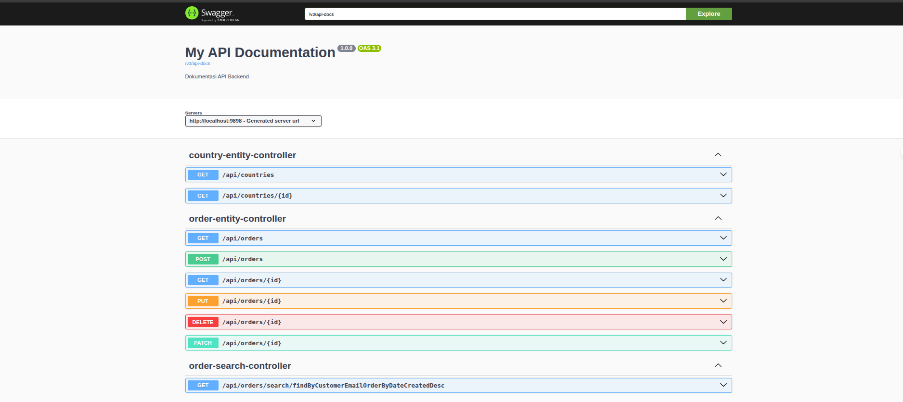
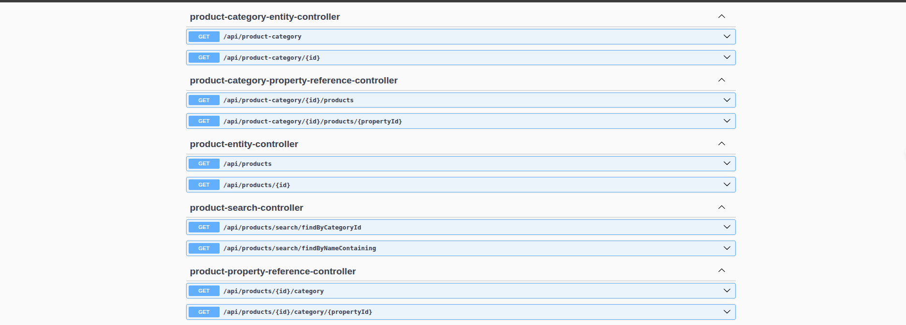
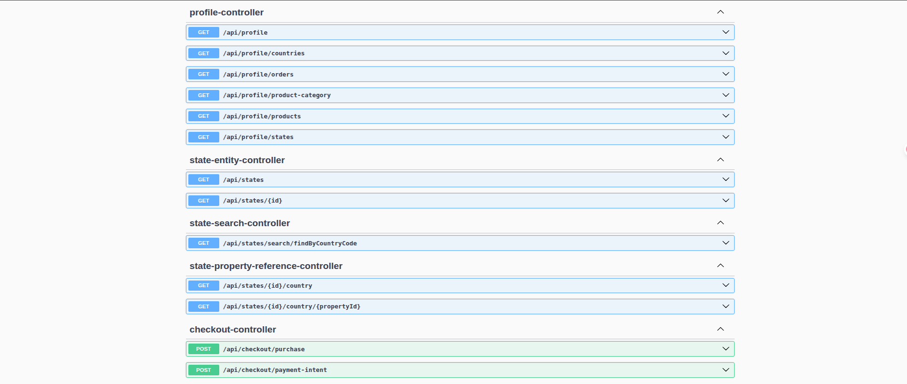
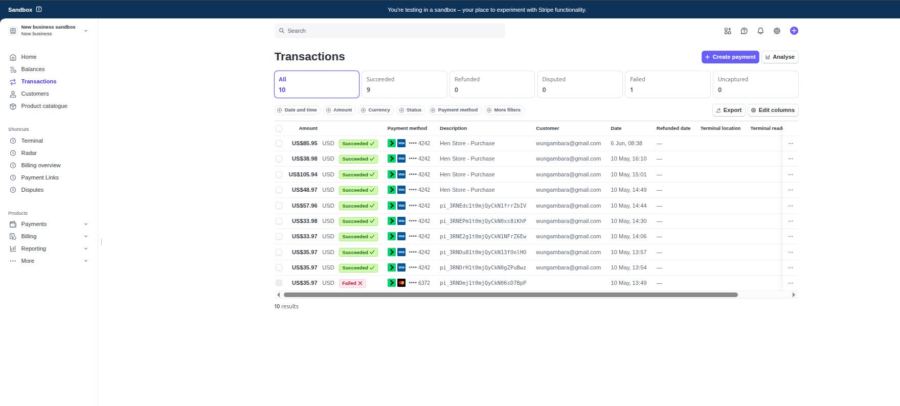
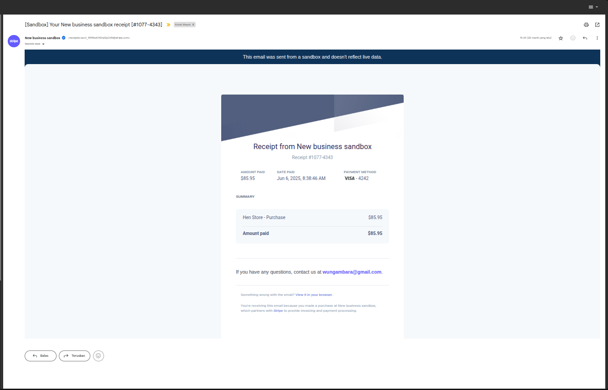

<div align="center">
  
</div>

<h1 align="center">🛍️ Spring Boot E-Commerce Backend System</h1>

<p align="center">
  A robust and scalable backend system for an E-Commerce platform built with <strong>Spring Boot</strong> and <strong>MySQL</strong>. Designed to handle product management, customer orders, authentication, and payment processing with modern best practices.
</p>

---

## 📚 Table of Contents

- [📖 Introduction](#-introduction)
- [✨ Features](#-features)
- [🧰 Technologies Used](#-technologies-used)
- [🏛️ Architecture](#-architecture)
- [⚙️ Installation](#-installation)
- [🚀 Usage](#-usage)
- [📘 API Documentation](#-api-documentation)

---

## 📖 Introduction

This backend system powers a modern e-commerce platform with core functionalities including:

- Secure user authentication and registration
- Product catalog and category management
- Shopping cart and order lifecycle handling
- Payment gateway integration with Stripe
- RESTful API support with Swagger documentation

Built for maintainability, security, and extensibility.

---

## ✨ Features

- 🔐 **OAuth2 Authentication** via Okta
- 📦 **Product & Category Management**
- 🛒 **Cart and Order Processing** with billing/shipping
- 💳 **Stripe Integration** for secure payments
- 📘 **Interactive API Documentation** with Swagger UI
- 🧩 **Relational Entity Design** using JPA & Hibernate

---

## 🧰 Technologies Used

- **Java 17** (Spring Boot)
- **MySQL** (Relational Database)
- **Spring Data JPA** (ORM)
- **Swagger** (API Testing & Docs)
- **Okta OAuth2** (Authentication)
- **Stripe** (Payments)

---

## 🏛️ Architecture

This project follows a modular and layered architecture:

- **Entities**: Core domain models (e.g., `Product`, `Order`, `Customer`)
- **Repositories**: Handle data persistence
- **Services**: Contain business logic
- **Controllers**: REST API endpoints
- **Security**: OAuth2 with Okta
- **Configuration**: Externalized settings via `.env` and `application.properties`

### 🔗 Entity Relationships

- One **Customer** → Many **Orders**
- One **Order** → Many **OrderItems**
- One **Order** → One **Shipping Address** & One **Billing Address**
- One **Product** → One **ProductCategory**

---

## ⚙️ Installation

### 📌 Prerequisites

- Java 17+
- Maven
- MySQL Server
- Okta Developer Account
- Stripe Developer Account

### 🧾 Setup Instructions

1. **Clone the Repository**
    ```bash
    git clone https://github.com/hendrowunga/spring-boot-ecommerce-backend.git
    cd spring-boot-ecommerce-backend
    ```

2. **Create `.env` File**  
   Copy example file and customize:
    ```bash
    cp .env.example .env
    ```

3. **Configure the `.env` File**  
   Update your credentials and configurations:
    ```env
    OKTA_CLIENT_ID=your-okta-client-id
    OKTA_ISSUER=https://your-okta-domain/oauth2/default

    DATABASE_URL=jdbc:mysql://localhost:3306/ecommerce
    DATABASE_USERNAME=root
    DATABASE_PASSWORD=password

    STRIPE_SECRET_KEY=your-stripe-secret
    ALLOWED_ORIGINS=http://localhost:3000
    ```

4. **Build the Project**
    ```bash
    mvn clean install
    ```

5. **Run the Application**
    ```bash
    mvn spring-boot:run
    ```

Once started, access the application at `http://localhost:9898`.

---

## 🚀 Usage

After running the app, you can interact with the system through:

- 🧪 **Swagger UI**: [http://localhost:9898/swagger-ui/index.html](http://localhost:9898/swagger-ui/index.html)
- 🔐 **Authentication**: Secure endpoints via Okta
- 🛍️ **Product APIs**: View, add, and manage products
- 📦 **Order APIs**: Place and manage customer orders

### 📡 Sample Endpoints

| Method | Endpoint | Description |
|--------|----------|-------------|
| `POST` | `/api/customers` | Register a new customer |
| `GET`  | `/api/products`  | Fetch product catalog |
| `POST` | `/api/orders`    | Create a new order |
| `GET`  | `/api/orders/{id}` | Get specific order details |

---

## 📘 API Documentation

Swagger UI provides a clean interface to test all APIs:

<div align="center">
  
</div>
<div align="center">
  
</div><div align="center">
  
</div>

🔗 Open in browser:  
[http://localhost:9898/swagger-ui/index.html](http://localhost:9898/swagger-ui/index.html)

---

## 📸 Sample Stripe Dashboard

### 🧾 Stripe Dashboard – Transactions View

The following image displays the **Stripe dashboard's transactions list**, where merchants can view the status and details of all payments processed through the system. For a successful test transaction, it shows key details such as:

- **Amount**: The total amount paid by the customer (e.g., US$85.95).
- **Status**: Confirmation of a successful payment (e.g., "Succeeded ✅").
- **Payment Method**: The card type and last four digits (e.g., Visa ending in 4242).
- **Description**: Details of the purchase (e.g., "Hen Store - Purchase").
- **Customer**: The customer's email address (e.g., `wungambara@gmail.com`).
- **Date**: The timestamp of the transaction.

<div align="center">
  
</div>

---

### 📧 Stripe Receipt Email – Example from Sandbox

Below is a sample email automatically sent by **Stripe** to the customer as a payment receipt after a successful transaction. This example is from the Stripe sandbox environment.

🧾 **Receipt #1077-4343**

- 💵 **Amount paid**: $85.95
- 🕒 **Date paid**: Jun 6, 2025, 8:38:46 AM
- 💳 **Payment method**: Visa ending in 4242

#### 💼 Summary:
- Hen Store - Purchase: **$85.95**
- **Amount paid**: **$85.95**

The email also provides a contact point for customer inquiries (e.g., `wungambara@gmail.com`).

<div align="center">
  
</div>

---

<div align="center">
  <p>Thank You</p>
</div>
