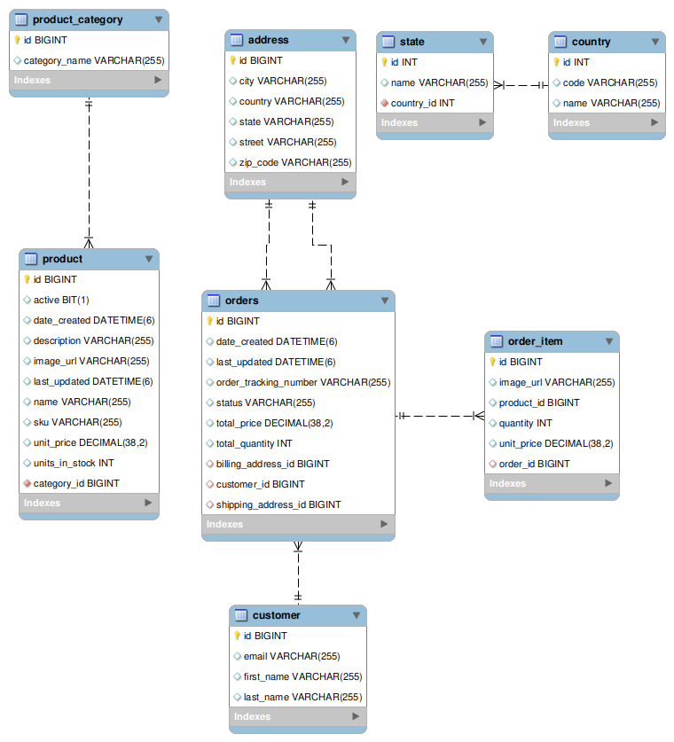

<div align="center">
  
</div>

<div align="center">
  <h1>E-Commerce Backend System</h1>
</div>
<div align="center">
  This repository contains the backend code for an E-Commerce platform built with **Spring Boot** and **MySQL**. It provides a robust solution for managing customer orders, products, categories, and more, designed with modern software engineering practices.
</div>


## 🚀 Table of Contents

- [Introduction](#-introduction)
- [Features](#-features)
- [Technologies Used](#-technologies-used)
- [Architecture](#-architecture)
- [Installation](#-installation)
- [Usage](#-usage)
- [API Documentation](#-api-documentation)
- [Testing](#-testing)

## 🔍 Introduction

This is the backend for a modern **E-Commerce platform** designed to handle:

- User authentication and management
- Product inventory management
- Order processing and shipment tracking
- Payment gateway integration
- Dynamic pricing and catalog management

It is designed to be scalable, secure, and highly extensible.

## ✨ Features

- **User Authentication** using OAuth2 and Okta.
- **Product and Category Management**.
- **Order and Cart Management** with shipping and billing details.
- **Stripe Integration** for secure payment handling.
- **Swagger UI** for easy API exploration.
- **Database Design** with relational mappings between entities (e.g., `Order`, `Product`, `Customer`, etc.).

## 💻 Technologies Used

- **Java** (Spring Boot)
- **MySQL** (Database)
- **Hibernate JPA** (ORM for managing database operations)
- **Swagger** (API documentation and testing)
- **[Okta](https://www.okta.com/)** (OAuth2 Authentication)
- **[Stripe](https://stripe.com/)** (Payment Integration)

## 🏗️ Architecture

The system follows **Microservice Architecture** and is built with best practices in mind:

- **Entities**: Define the structure of the main components such as `Product`, `Order`, `Customer`, `Address`, and `Payment`.
- **Repositories**: Encapsulate the logic for querying and persisting data in the database.
- **Services**: Contain the business logic.
- **Controllers**: Handle HTTP requests and map them to corresponding services.

The key relationships between entities are:

- A **Customer** can have multiple **Orders**.
- An **Order** contains multiple **OrderItems**.
- An **Order** has one **Billing Address** and one **Shipping Address**.
- Each **Product** belongs to a **ProductCategory**.


## 🛠️ Installation

Follow these steps to get your environment set up:

### Prerequisites
- **JDK 17** or later
- **Maven** for building the project
- **MySQL** database server
- **Okta Account** for OAuth2 authentication (visit [Okta](https://www.okta.com/) to create one)
- **Stripe Account** for payment integration (visit [Stripe](https://stripe.com/) to create one)

### Setup

1.  **Clone the repository**:
    ```bash
    git clone https://github.com/hendrowunga/spring-boot-ecommerce-backend.git
    cd spring-boot-ecommerce-backend
    ```

2.  **Set up your `.env` file** for environment variables:

    *   Copy `.example.env` to `.env`:

        ```bash
        cp .env.example .env
        ```

3.  **Configure the `.env` file**:
    Add your Okta credentials, MySQL connection details, and Stripe API keys in the `.env` file.

4.  **Build the project**:

    ```bash
    mvn clean install
    ```

5.  **Run the application**:

    ```bash
    mvn spring-boot:run
    ```

The application will be running at `http://localhost:9898`.

## 🚀 Usage

Once the application is running, you can access the following endpoints:

*   **Swagger UI**: Visit `http://localhost:9898/swagger-ui/index.html` to explore and test the API.
*   **Authentication**: Use Okta to authenticate and manage users.
*   **Order Management**: Create, update, and track orders.
*   **Product Management**: Add and manage products and categories.

### API Endpoints

*   `POST /api/customers`: Register a new customer.
*   `GET /api/products`: Get a list of all products.
*   `POST /api/orders`: Create a new order.
*   `GET /api/orders/{id}`: Get order details.

## 📚 API Documentation

The **API documentation** is available via **Swagger UI**. All endpoints are described in detail, including required parameters and responses.

Access it [here](http://localhost:9898/swagger-ui/index.html).

## 🧪 Testing

1.  **Unit Tests**: We use **JUnit** and **Mockito** for unit testing.
2.  **Integration Tests**: The tests are located in `src/test/java` and can be run using:

    ```bash
    mvn test
    ```